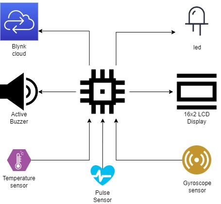
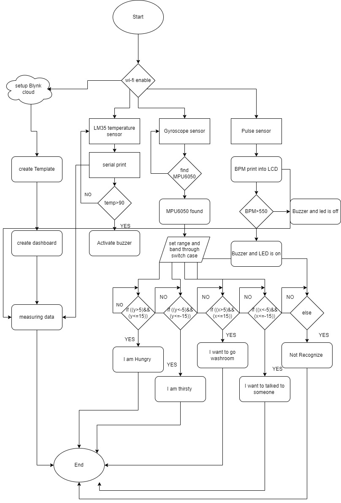
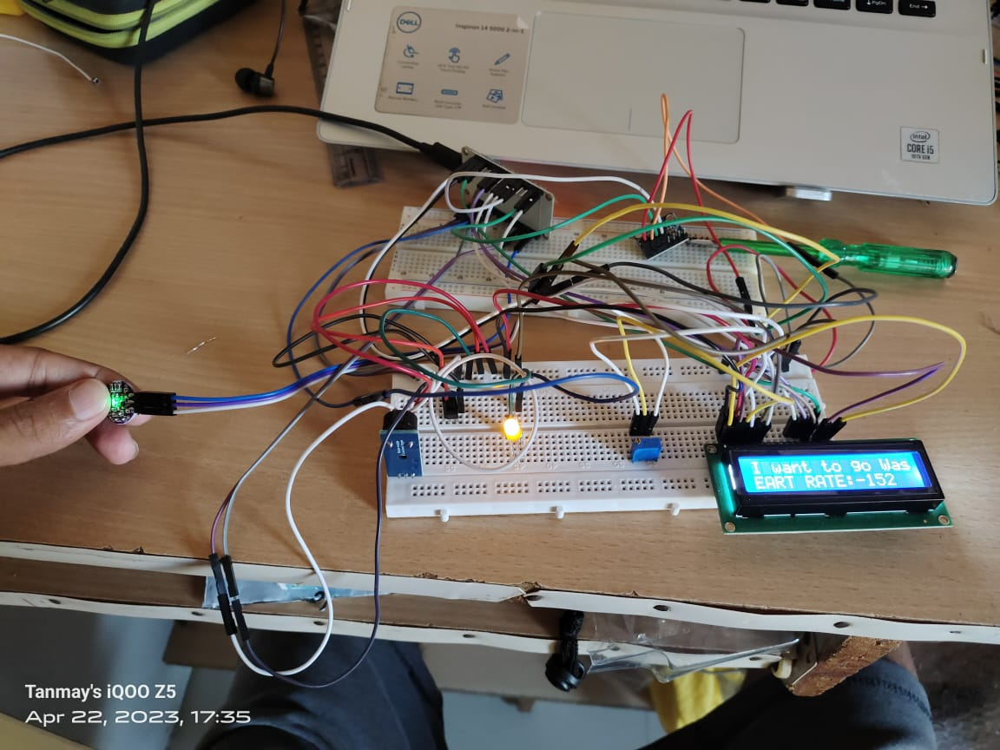
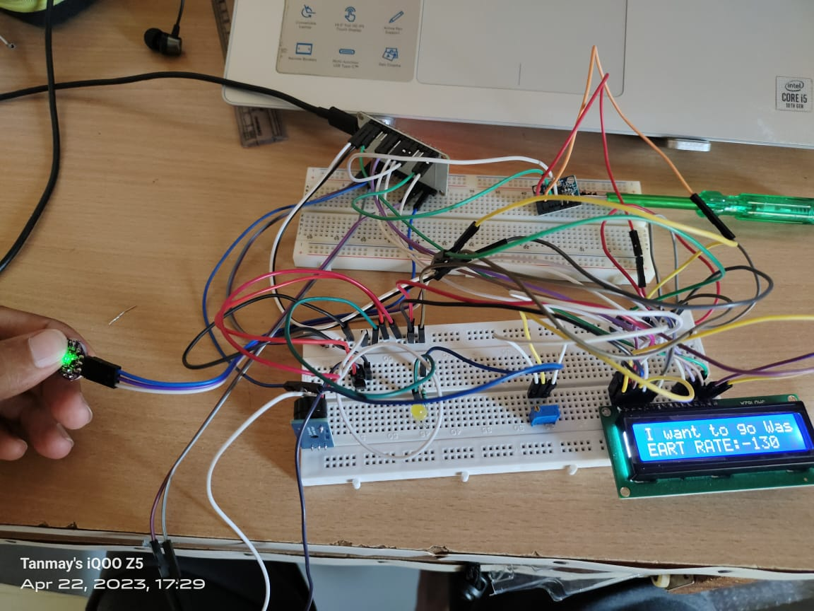
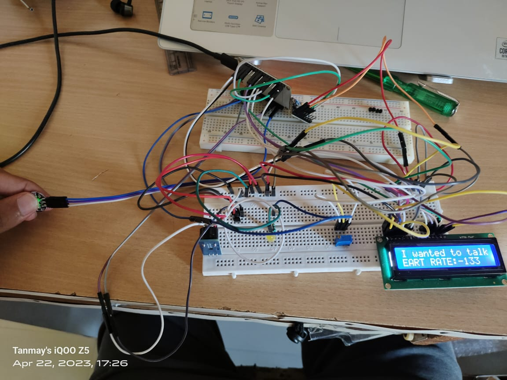

# 🏥 Paralyzed Patient Health Monitoring System (IoT)

This repository contains the design, documentation, and source files for a comprehensive IoT-based healthcare solution aimed at assisting paralyzed patients. The system provides real-time monitoring of crucial vital signs and incorporates gesture-based communication to help patients convey messages using basic physical movements.

## 🎯 Project Objective
Paralysis limits a patient's ability to communicate requirements and independently monitor their physical state. This system bridges that gap by continuously tracking health metrics (temperature, heart rate) and translating body movements into actionable data, all of which is monitored both locally and remotely via the cloud.

## 🛠️ Hardware Architecture
The core of the system is built around wireless IoT data transmission.
* **Microcontroller:** ESP32 (provides integrated Wi-Fi connectivity)
* **Sensors:** * **MPU6050:** Accelerometer and Gyroscope to detect body movements and gestures.
    * **Pulse Rate Sensor:** To monitor heart rate.
    * **Temperature Sensor:** To track body temperature.
* **Display:** 16x2 LCD Display for local, bedside monitoring.

## 💻 Software & Cloud Integration
* **Development Environment:** Arduino IDE (C/C++)
* **Cloud Platform:** Blynk Cloud. The ESP32 securely transmits the processed sensor data to Blynk, allowing doctors or caretakers to access real-time dashboards from anywhere via a web-based interface or mobile app.

## 🔀 System Design & Flow

### Block Diagram
*(The hardware layout and sensor integration)*

### IoT Design Flow
*(The data transmission path from the patient to the cloud)*

## 📊 Experimental Results
The system successfully demonstrated accurate data collection and seamless transmission. Below are the execution results and hardware demonstrations:

## 🗂️ Documentation
For a deep dive into the methodology, circuit design, and full research analysis, please refer to the project reports included in this repository:
* `19EC056_Tanmay_Patel_EC458_Project.pdf` - Full B.Tech Project Report
* `19EC056_EC458_Project.pptx` - Presentation Slides

---
*Project developed by Tanmay Patel (19EC056) for EC458 at CHARUSAT.*
